# Stroke Risk Predictive Analysis

## Project Bookmarks:

-   [README](https://github.com/ali-khurshid/stroke-risk-predictive-analysis/blob/main/README.md)
-   [Project board](https://github.com/users/ali-khurshid/projects/7)
-   [Raw Data](https://github.com/ali-khurshid/stroke-risk-predictive-analysis/blob/main/Data/raw-dataset-stroke-data.csv) | [Clean data](https://github.com/ali-khurshid/stroke-risk-predictive-analysis/blob/main/Data/cleaned_data.csv)
-   [ETL Jupyter Notebook - EDA](https://github.com/ali-khurshid/stroke-risk-predictive-analysis/blob/main/jupyter_notebooks/01%20-%20stroke_eda.ipynb)
-   [ETL Jupyter Notebook - Hypothesis Testing](https://github.com/ali-khurshid/stroke-risk-predictive-analysis/blob/main/jupyter_notebooks/02%20-%20hypothesis_testing.ipynb)
-   [ETL Jupyter Notebook - Feature Engineering](https://github.com/ali-khurshid/stroke-risk-predictive-analysis/blob/main/jupyter_notebooks/03%20-%20feature_engineering_backup.ipynb)
-   [ETL Jupyter Notebook - ML Modeling](https://github.com/ali-khurshid/stroke-risk-predictive-analysis/blob/main/jupyter_notebooks/04%20-%20modeling.ipynb)
-   [Streamlit](https://risk-prediction-for-stroke.streamlit.app/)
-   [Conclusion and Discussion](#conclusion-and-discussion)

## Table of Contents:

-   [Project Overview](#project-overview)
-   [Dataset Content](#dataset-content)
-   [Business Requirements](#business-requirements)
-   [Hypothesis Testing and Validation](#hypothesis-testing-and-validation)
-   [Rationale to map business requirements](#the-rationale-to-map-the-business-requirements-to-the-data-visualisations)
-   [Analysis Techniques Used](#analysis-techniques-used)
-   [Project Plan](#project-plan)
-   [Project Board](#project-board)
-   [Ethical Consideration](#ethical-considerations)
-   [Streamlit App](#streamlit-app)
-   [Unfixed Bugs and Challenges Faced](#unfixed-bugs-and-challenges-faced)
-   [Development Roadmap](#development-roadmap)
-   [Main data Analysis Libraries](#main-data-analysis-libraries)
-   [Findings](#findings)
-   [Conclusion and Discussion](#conclusion-and-discussion)
-   [Credits](#credits)
-   [Acknowledgements](#acknowledgements)

## Project Overview
This project analyzes stroke risk factors in patients and provides visualizations and insights to guide preventative measures. I explored both numerical and categorical features to understand their relationship with stroke occurrences, performed hypothesis testing, and visualized distributions for key variables.

---

## Dataset Content
The [Stroke Prediction Dataset](https://www.kaggle.com/datasets/fedesoriano/stroke-prediction-dataset) downloaded from kaggle contains patient records including demographic information, health indicators, and lifestyle factors. Key features include:

- **Numerical:** 

    - `age` 
    - `avg_glucose_level`
    - `bmi`
- **Categorical:** 

  - `gender` 
  - `hypertension`
  - `heart_disease` 
  - `ever_married` 
  - `work_type`
  - `residence_type` 
  - `smoking_status`
- **Target:** 

  - `stroke` (0 = no stroke, 1 = stroke)

---

## Business Requirements
- Identify the features most associated with stroke risk.
- Provide clear visualizations to support ML model creation
- Ensure the analysis is reproducible and interpretable.
- Understand imbalanced data impact
- Check if prediction works for educational purposes or real life application
- Ensure AI & ML ethical attributes are considered.

---

## Hypothesis Testing and Validation

T-test was used for the numerical features while the
Chi-square test was used for the categorical features

Significance level Alpha = 0.05.

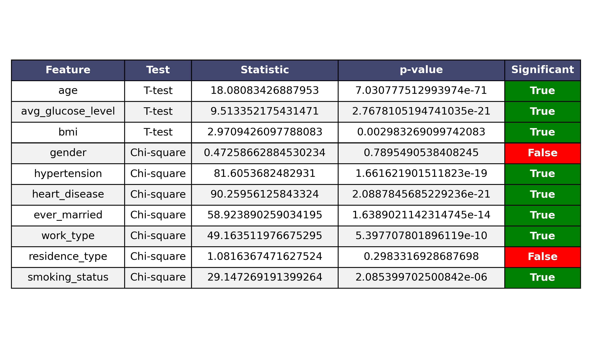

The only two features that did not have any significant impact on the occurence of a stroke were

- `gender`
- `residence_type`
------

## The rationale to map the business requirements to the data visualisations

- **Distributions** help identify patterns and potential outliers.
- **Hypothesis testing tables** highlight which features are significantly associated with stroke.
- **Categorical plots** provide clear counts for each subgroup, aiding interpretation for healthcare stakeholders.
- **Violin and Boxplots** helps understand relationships between primary and secondary features vs stroke occurence.
- **Model performance metrics** helps to understand how well the model is performing and whether fine tuning is required to improve it

- **Feature engineering** was used to unify the column labels and get them to `.str.lower()` . In addition, `.replace` was used to consolidate 'unknown' and 'other' entries in the column by substituting them with the most frequently occurring value. Converting columns `age` and `bmi` to `int` for modeling was also carried out.

**Below are some of the data visualisations**

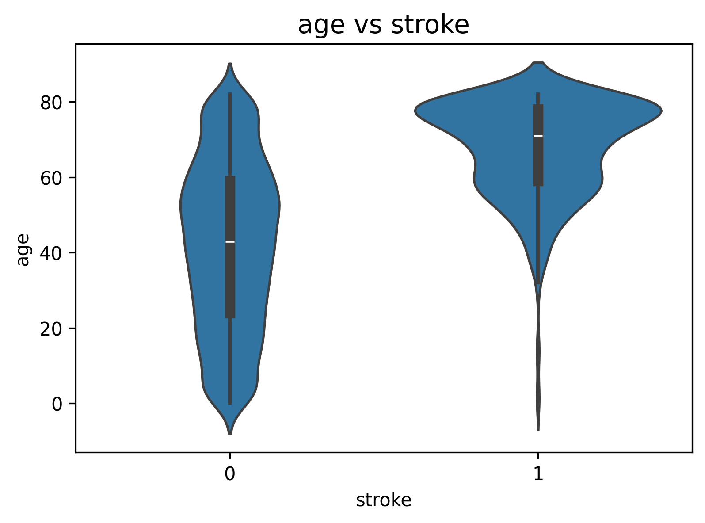

Distribution of age vs patients who suffered a stroke vs those who didn't. It highlights that stroke occurence is more concentrated among older patients.

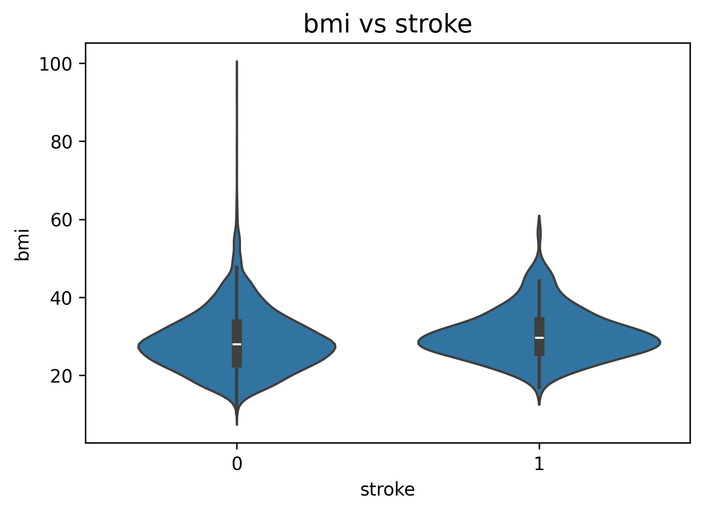

Patients who suffered a stroke are not necessarily overweight, as the distribution for both stroke vs non stroke patients is nearly the same. However, medical research suggests BMI is one of several risk factors for stroke. My analysis is that BMI alone may not be a driving factor in my dataset.

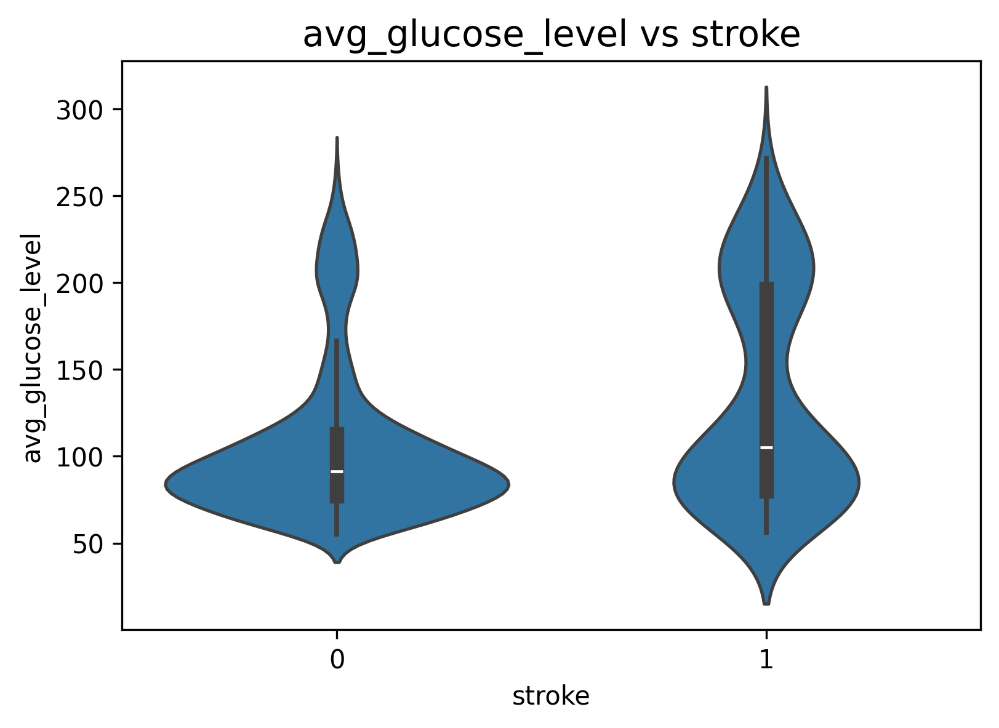

The average glucose level for pateints that experienced a stroke is on the higher side compared the those that didn't implying elevated glucose levels are strongly associated with stroke risk.

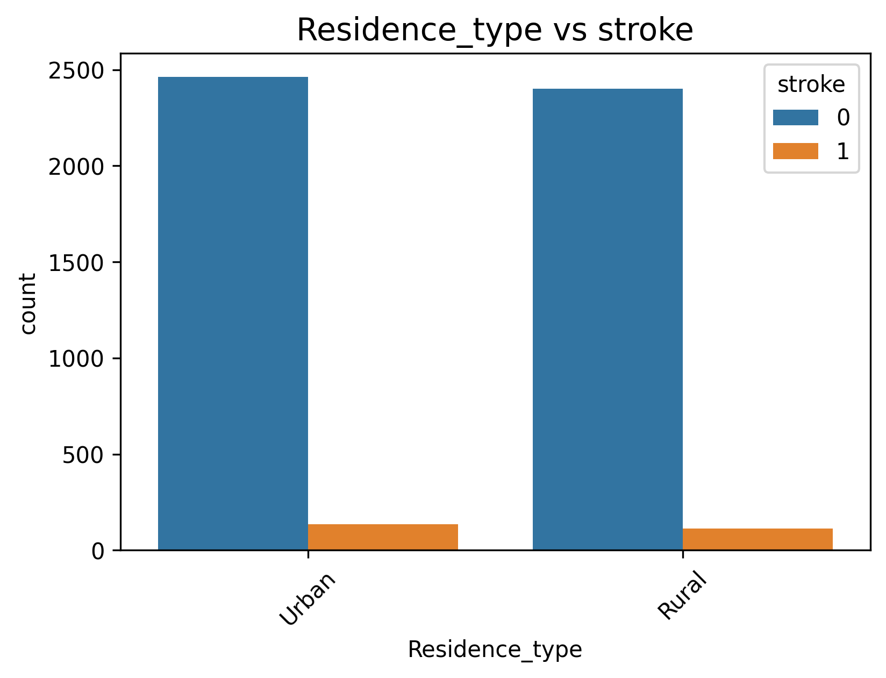

This chart confirms the finding of our null hypothesis testing. Residence type does not have a significant impact on the occurence of stroke in individuals, however, we must be careful as it could well become a driving force when compounded with other highly relatable factors.

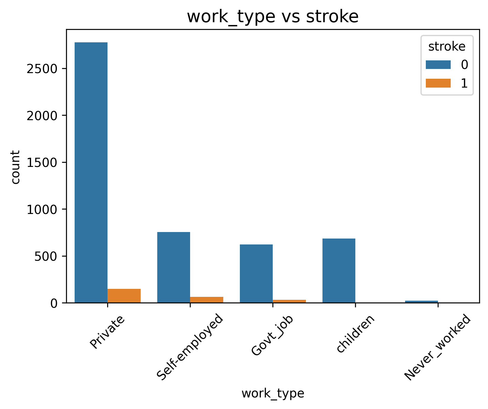

Individuals working in the private sector show the highest occurence of stroke and non stroke, followed by self-employed. However, as a standalone factor they impact is not high.

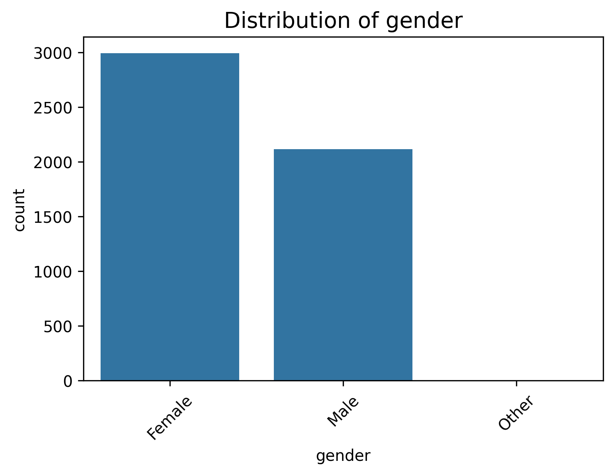

We have a near equal distribution of both genders in our dataset. A balanced feature is always good to have.

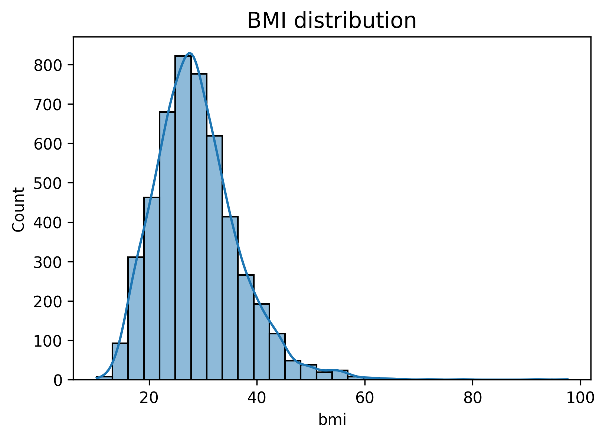

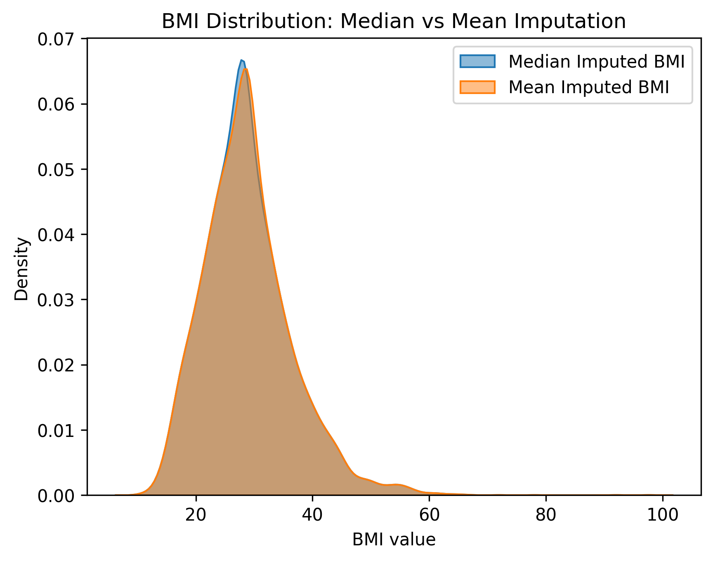

 The BMI distribution is slightly skewed towards the right but overall it shows a normal distribution. In deciding whether to use Mean or Median as an imputation method, both were applied the missing BMI values and a second chart was plotted. THis is a density plot against the BMI values after imputation. It shows that both, Mean and Median perform equally well in handling missing values. However. median imputation was eventually selected based on the fact that it is more robust for slightly skewed distributions.

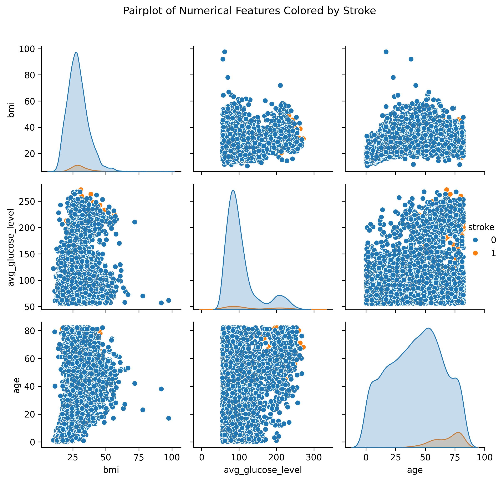

This pairplot chart suggests that the strongest bivariate features in patients suffering from a stroke tend to be older and higher average glucose level ones. It also confirms that BMI appears less distinct between both stroke and non stroke patients.

---

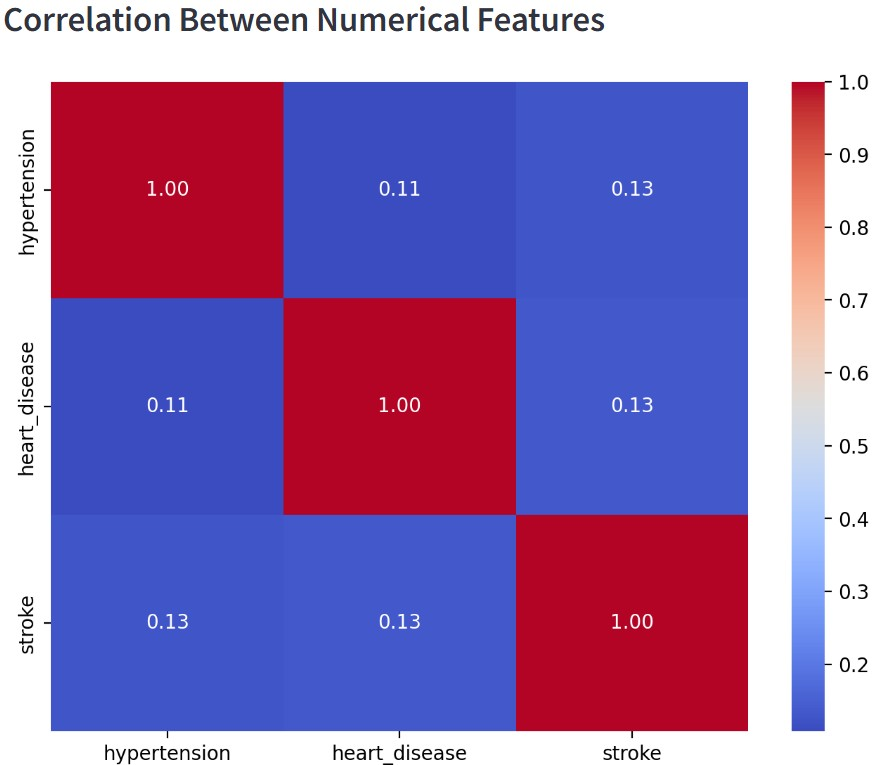

Mild correlations exist between hypertension, heart disease & stroke. This suggests that the probability of a stroke occuring in older patients with high average glucose levels will be compounded with pre-existing medical conditions.

---

## Analysis Techniques Used
*  Descriptive statistics for numerical and categorical features
- Data visualization using histograms, count plots, violinplots, pairplots, correlation heatmaps and boxplots
- Hypothesis testing:
  - `T-test` for numerical features
  - `Chi-square` test for categorical features

- `SMOTE` to address imbalanced data class.

- Modeling
  - `Pipeline` to create ML pipelines.
  - `ColumnTransformer` to apply different preprocessing steps to different column of a single pipeline.
  -`OneHotEncoder` to convert categorical values into numerical values.
  - `SimpleImputer` to handle missing data with a selected strategy.
  - `LogisticRegression` for ML modeling and training
  - `RandomForest` for ML modeling and training
  
- Improving Model Performance

  - `classification_report`
  - `confusion_matrix`
  - `accuracy_score`
  - `roc_auc_score`

- `GridsearchCV` to find best hyperparameters to impprove the model's performance

## Project Plan

| Day             |      Plan                                     |                   Responsibility                        |
| :-------------- | :-------------:                               | :------------------------------------------------:      |
| Monday          |  Load data and EDA                            | Perform EDA and understand relationships. Clean the data|
| Tuesday         |  Hypothesis creation and testing              |  Hypothesis assesment to understand impact of features on target         |
| Wednesday       |  Feature Engineering and Model creation       |  Data visualisation and data preparation for the model  |
| Thursday        |  Hyperparameter Tuning and Prediction         |     Using best performance parameters for prediction    |
| Friday          |  Streamlit and ReadME                         |            App creation, deployment and documentation   |

## Project Board

A snapshot of the project board midway through my capstone project.

---

## Ethical Considerations
- Data anonymization: No personally identifiable information is used.
- Bias awareness: Considered potential disparities across gender, age, and lifestyle factors.
- Responsible reporting: Visualizations are intended for insight and educational purposes, not clinical decision-making.

**AI & ML Ethics**
  - I acknowledge that biased data can lead to unfair predictions for certain groups, especially in healthcare where impacts can be serious.
  - I attempted to mitigate this by examining distributions, correlations and ensuring transparency in preprocessing, but biases may still exist.
  - The target variable (Stroke) in my dataset had heavy class imbalance, this was taken into account while training and building the model.
  - This model is not intended to replace clinical judgement or be deployed in a healthcare setting. It serves only as an educational analytical tool for understanding relationships, patterns and predictive modelling techniques.

---

## Streamlit App
I created a Streamlit app to allow interactive exploration of the dataset features, relationships and distributions. Users can predict stroke risk for a given patient using a prediction calculator. 

You can access the app and explore here: https://risk-prediction-for-stroke.streamlit.app/

The app is a multi-paged dashboard consisting of:

- **Overview** - A summary of the dataset and project tools used.
- **Data Analysis** - is made up of 5 tabs and discusses the raw data, numerical and categorical features, their importance and a correlation heatmap.
- **Feature Engineering** - Shows how the raw data was cleaned, transformed and encoded to make it model-ready. It also talks about the Pipeline that was eventually built.
- **Prediction App** - patient stroke risk calculator based on the available dataset.
- **Model Performance** - looks into the performance of ML model and predictive capabilities.

## Unfixed Bugs
- I am not sure why my streamlit performance metrics are too high compared to my model. This could be an unfixed bug or probably due to the fact that streamlit inflates the performace metric as it uses the full datset not just the test set.

---

## Development Roadmap

<u>**Challenges Faced**</u>

- Ran into major difficulty while deploying Streamlit to the cloud.
- Ran into several bugs and issues that needed help from ChatGPT and Co-Pilot to resolve.
- It was evident early on that the dataset would be difficult to model effectively, given the significant class imbalance in the target variable stroke, which required careful handling during preprocessing and model training.

<u>**What Next**</u>

- Improving Data
    - Try a new dataset with more patient records
    - Additional feature engineering such as:

    - Age → age groups
    - BMI → obesity categories
    - Glucose - identify risk levels or categories

- Try more powerful classifiers like:

    - XGBoost
    - LightGMB
    - Catboost

 - Improve class imbalance handling

    - ADASYN
    - SMOTEENN
    - Borderline - SMOTE

- External Validation

    - Test the model on different hospital data
    - Test it on a differnet population and/or geoographic location.
    - Test it at different time periods.

---

## Main Data Analysis Libraries
The following libraries were used in my project.

 - `helpers`
 - `joblib`
- `matplotlib` . `pyplot`
- `numpy`
- `os`
- `Pandas`
 - `pyexpat`
- `scipy` . `stats`
- `seaborn`
- `sklearn` . `pipeline`
- `sklearn` . `compose`
- `sklearn` . `preprocessing`
- `sklearn` . `impute`
- `sklearn` . `linear_model`
- `sklearn` . `metrics`
- `imblearn` . `oversampling`
- `sklearn` . `model_selection`
- `sklearn` . `ensemble`
- `streamlit`
 

---

## Findings

**Relationship of the Features with the Target Variable**
- **Age**, **avg_glucose_level**, and **bmi** show statistically significant differences between stroke and non-stroke groups.  
- **Hypertension**, **heart_disease**, **ever_married**, and **smoking_status** are significantly associated with stroke incidence.  
- Features such as **gender**, **work_type**, and **residence_type** showed less direct association with stroke in this dataset.  
- The results suggest that **health indicators** (age, glucose level, BMI, hypertension, heart disease) are the most critical factors to monitor for stroke risk.  
- These insights can guide targeted preventive measures and form the basis for further predictive modeling of stroke risk.
- However, given the low success is predicting a stroke, this model needs further investigation, evaluation and testing using more advanced classifiers and tools. 

**Machine Learning Findings**

<u>*Class Imbalance*</u>

During exploratory analysis, it was found that the original dataset was highly imbalanced, with stroke =1 representing only 5% of records. Initial models would have massively skewed in prediciting the major class (stroke = 0) overwhelmingly, which would have led to:

 - misleading sense of high accuracy
 - extremely low recall for stroke cases
 - the inability to correctly flag hish risk patients

 A correction on the imbalance was critical.

<u>*SMOTE Oversampling*</u>

To correct the imbalance SMOTE was applied to the training set only. This resulted in:

 - 50/50 split between stroke cases in the original dataset as opposed to 95/5.
 - Prevented the model from learning a bias towards predicitng "no stroke".
 - Both Logistic Regression and RandomForest achieved better recall and F1 scores.

<u>*Logistic Regression Findings*</u>

Below is the performance of Logistic Regression.

*Confusion Matrix*

True negatives = 643

True positives = 45

False positives = 573

False negatives = 17

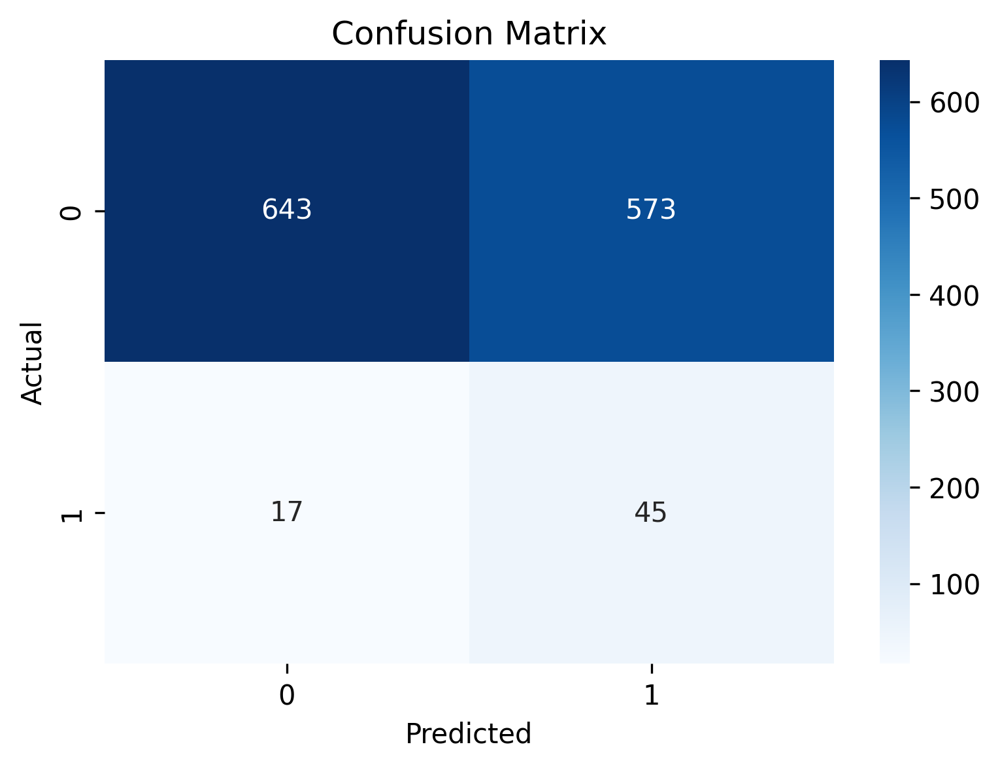

*Classification report*

The model achieves 53.8% accuracy, performing well on predicting no-stroke cases but struggling with stroke cases due to class imbalance. It correctly identifies most actual strokes (high recall) but also produces many false alarms (low precision). Overall, it highlights the challenge of predicting rare events and suggests that balancing the dataset or using alternative models could improve performance.

<u>**Motivation for Using Random Forest**</u>

Because this model predicted the majority class (no stroke) well but struggled with the minority class (stroke), I opted to switch to Random Forest, which better handles class imbalance and captures complex patterns in the data.

Random Forest can manage skewed datasets more effectively, especially when combined with techniques like SMOTE or class weighting.

Reduces overfitting: By averaging multiple decision trees, it generalizes better than a single classifier.

Captures complex patterns: Stroke prediction involves non-linear relationships between features (age, BMI, heart conditions, etc.), which Random Forest handles well.

Robust to noisy data: It can maintain performance even with irrelevant or correlated features.

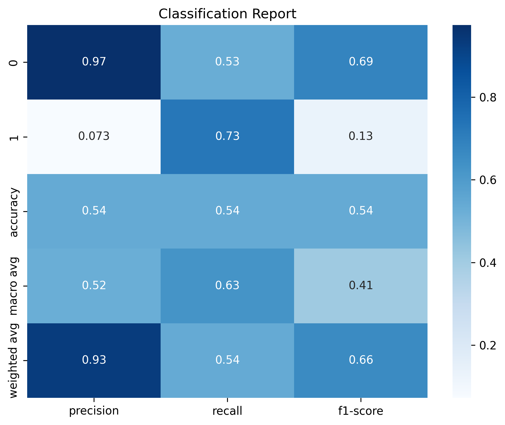

- **Accuracy: 53.8%**

- Stroke class (1) — **Precision: 0.07, Recall: 0.73, F1-score: 0.13**

- Non-stroke class (0) — **Precision: 0.97, Recall: 0.53, F1-score: 0.69**

- Insight: Captured most stroke cases (high recall) but produced many false positives (very low precision), overall performance limited by imbalance.

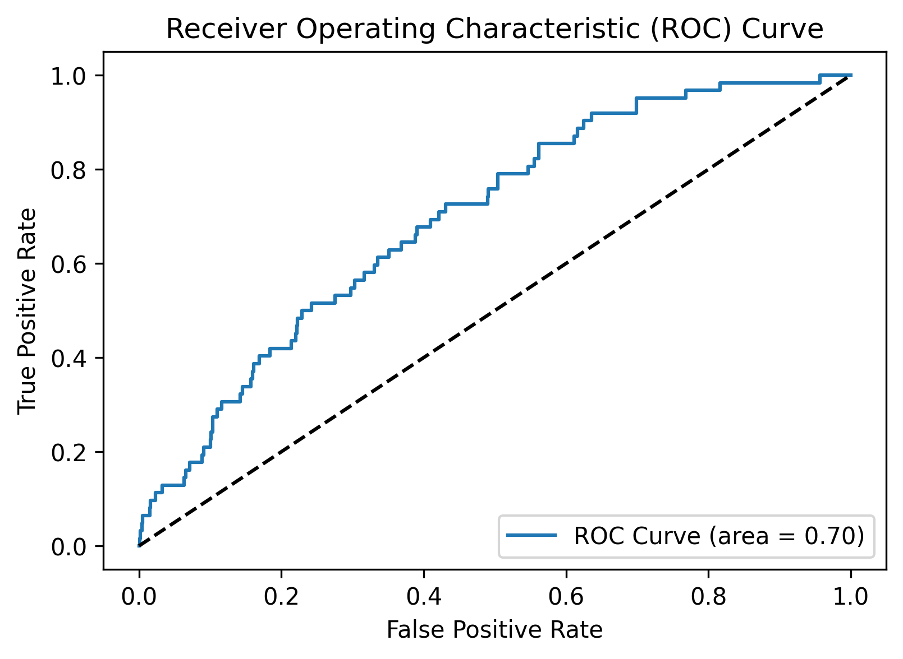

This model did not perform very well, owing to the fact that the imbalance of stroke class still existed despite correcting it with SMOTE. 

<u>*Random Forest Classifier Findings*</u>

*Confusion Matrix*

True negatives = 1208

True positives = 1

False positives = 8

False negatives = 61

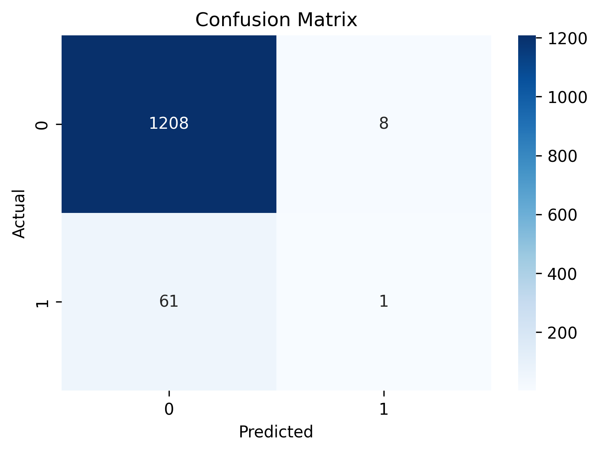

Strongly predicts the majority class (no stroke) correctly.

True positives for stroke dropped drastically (from 45 → 1), meaning it almost completely misses actual stroke cases.

**Interpretation**

Random Forest improved overall accuracy by predicting the majority class extremely well.

However, it sacrificed detection of the minority class, highlighting that class imbalance still affects the model.

This shows the need for additional techniques (e.g., SMOTE, class weighting, or tuning thresholds) to reliably predict stroke cases.

- **Accuracy: 95%**

- Stroke class (1) — **Precision: 0.11, Recall: 0.02, F1-score: 0.03**

- Non-stroke class (0) — **Precision: 0.95, Recall: 0.99, F1-score: 0.97**

- Insight: Strong overall accuracy and excellent prediction for the majority class, but almost completely misses stroke cases (very low recall for class 1).

<u>*Tuning of hyperparameters of Random Forest*</u>

After hyperparameter tuning, the Random Forest model was optimized with:

- `class_weight='balanced'` to address class imbalance

- `max_depth=20`, `min_samples_split=2`, `min_samples_leaf=1`
`n_estimators=200` for robust ensemble learning

**Performance:**

**Accuracy: 90%**.

Confusion Matrix shows strong prediction for the majority class (no stroke), but the minority class (stroke) is still under-predicted:

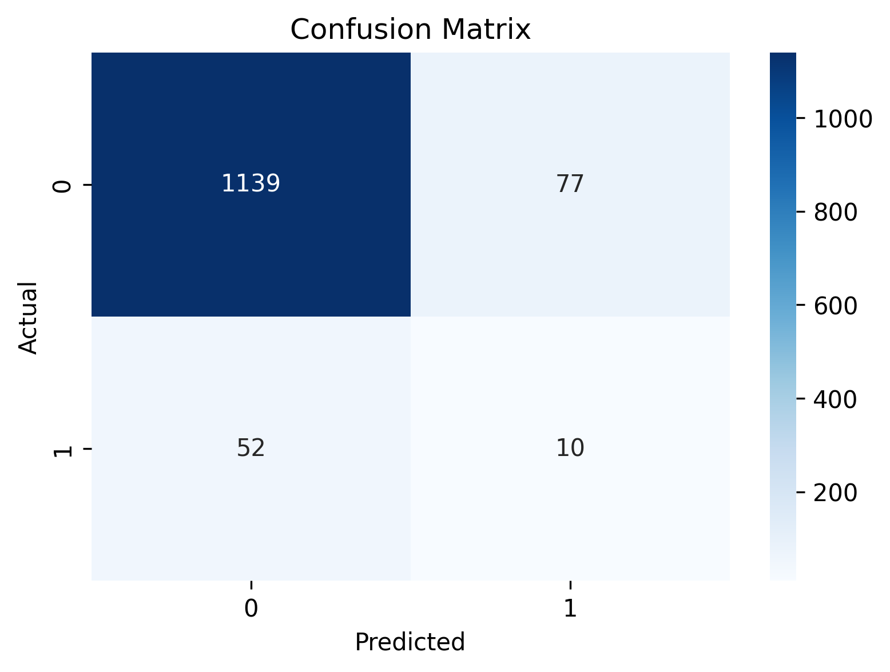

- Stroke class (1) — **Precision: 0.11, Recall: 0.16, F1-score: 0.13**

- Non-stroke class (0) — **Precision: 0.96, Recall: 0.94, F1-score: 0.95**

- **ROC AUC: 0.65**, indicating moderate discriminatory ability between stroke and no-stroke classes.

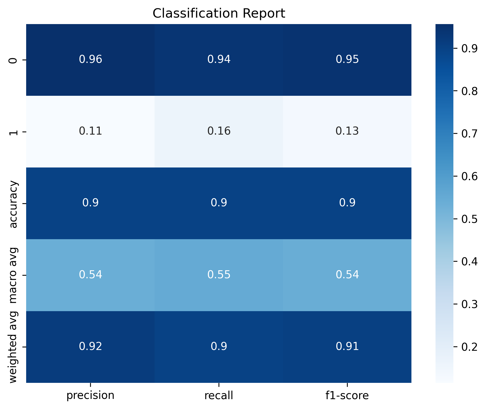

## Conclusion and Discussion

Logistic Regression caught more actual stroke cases (higher recall) but misclassified many non-stroke cases, leading to low overall accuracy.

Random Forest improves overall predictive stability and handles complex patterns better, which is valuable for a multi-feature dataset.

Even though Random Forest currently underperforms on the minority class, it provides a strong foundation to combine with balancing techniques (e.g., SMOTE, class weighting) to improve stroke detection while maintaining robust overall accuracy.

Class imbalance is the primary challenge; techniques like SMOTE, ensemble methods, or cost-sensitive learning could improve minority class performance.

Feature engineering and incorporating additional relevant health data may further enhance predictive power.

The model provides a foundation for a stroke risk prediction tool, useful for raising awareness or screening, but should be supplemented with clinical validation before real-world use.

---

## Credits 

### Content 

- ChatGPT helped me rephrase my englih and sentence construction in this document.
- ChatGPT was used to help create code and debug errors. It alsohelped unblock deployment of my Streamlit app to the cloud, which took several hours to complete.
- Dataset downloaded from [Kaggle](https://www.kaggle.com/datasets).

### Media

- The banner used for my README document was created by Microsoft Co-Pilot.
- All charts and visualisations were created by Python coding.

## Acknowledgements

* Special thanks to our facilitator Emma Lamont, Our Tutors Neil, Michael and Spencer for making this course easy to learn.
* I'd like to thank all my colleagues for being a fun group to work with.