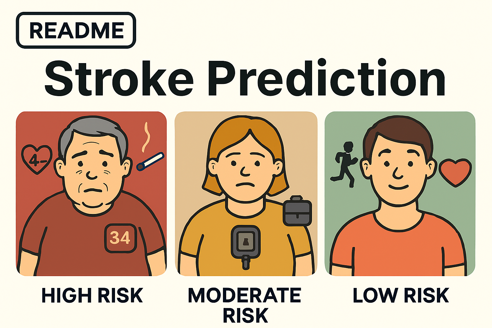

# Stroke Risk Predictive Analysis

Project bookmarks:

-   [README](https://github.com/ali-khurshid/stroke-risk-predictive-analysis/blob/main/README.md)
-   [Project board](https://github.com/users/ali-khurshid/projects/7)
-   [Raw Data](https://github.com/ali-khurshid/stroke-risk-predictive-analysis/blob/main/Data/raw-dataset-stroke-data.csv) | [Clean data](https://github.com/ali-khurshid/stroke-risk-predictive-analysis/blob/main/Data/cleaned_data.csv)
-   [ETL Jupyter Notebook - EDA](https://github.com/ali-khurshid/stroke-risk-predictive-analysis/blob/main/jupyter_notebooks/01%20-%20stroke_eda.ipynb)
-   [ETL Jupyter Notebook - Hypothesis Testing](https://github.com/ali-khurshid/stroke-risk-predictive-analysis/blob/main/jupyter_notebooks/02%20-%20hypothesis_testing.ipynb)
-   [ETL Jupyter Notebook - Feature Engineering](https://github.com/ali-khurshid/stroke-risk-predictive-analysis/blob/main/jupyter_notebooks/03%20-%20feature_engineering_backup.ipynb)
-   [ETL Jupyter Notebook - ML Modeling](https://github.com/ali-khurshid/stroke-risk-predictive-analysis/blob/main/jupyter_notebooks/04%20-%20modeling.ipynb)
-   [Streamlit](https://capstone-ali-stroke-risk-prediction.streamlit.app/Prediction_App)
-   [Conclusion and Discussion](#conclusion-and-discussion)

## Contents:

-   [Project Overview](#project-overview)
-   [Dataset Content](#dataset-content)
-   [Business Requirements](#business-requirements)
-   [Hypothesis Testing and Validation](#hypothesis-testing-and-validation)
-   [Rationale to map business requirements](#the-rationale-to-map-the-business-requirements-to-the-data-visualisations)
-   [Analysis Techniques Used](#analysis-techniques-used)
-   [Development Roadmap](#development-roadmap)
-   [Libraries & External Software Used](#libraries--external-software-used)
-   [Conclusion and discussion](#conclusion-and-discussion)
-   [Limitations](#limitations-to-the-dataset)
-   [Credits](#credits)
-   [Acknowledgements](#acknowledgements)

## Project Overview
This project analyzes stroke risk factors in patients and provides visualizations and insights to guide preventative measures. I explored both numerical and categorical features to understand their relationship with stroke occurrences, performed hypothesis testing, and visualized distributions for key variables.

---

## Dataset Content
The dataset contains patient records including demographic information, health indicators, and lifestyle factors. Key features include:

- **Numerical:** `age`, `avg_glucose_level`, `bmi`
- **Categorical:** `gender`, `hypertension`, `heart_disease`, `ever_married`, `work_type`, `residence_type`, `smoking_status`
- **Target:** `stroke` (0 = no stroke, 1 = stroke)

---

## Business Requirements
- Identify the features most associated with stroke risk.
- Provide clear visualizations to support healthcare decision-making.
- Ensure the analysis is reproducible and interpretable.

---

## Hypothesis Testing and Validation
* List here your project hypothesis(es) and how you envision validating it (them)

## The rationale to map the business requirements to the Data Visualisations
- **Distributions** help identify patterns and potential outliers.
- **Hypothesis testing tables** highlight which features are significantly associated with stroke.
- **Categorical plots** provide clear counts for each subgroup, aiding interpretation for healthcare stakeholders.

---

## Analysis techniques used
*  Descriptive statistics for numerical and categorical features
- Data visualization using histograms, count plots, violinplots, pairplots, correlation heatmaps and boxplots
- Hypothesis testing:
  - T-test for numerical features
  - Chi-square test for categorical features

## Project Plan
* Outline the high-level steps taken for the analysis.
* How was the data managed throughout the collection, processing, analysis and interpretation steps?
* Why did you choose the research methodologies you used?

---

## Ethical considerations
- Data anonymization: No personally identifiable information is used.
- Bias awareness: Considered potential disparities across gender, age, and lifestyle factors.
- Responsible reporting: Visualizations are intended for insight and educational purposes, not clinical decision-making.

---

## Streamlit App
* I created a Streamlit app to allow interactive exploration of features, distributions, and hypothesis test results. Users can filter by feature or subgroup to gain insights in a visual and intuitive format.

(https://churn-crusher-dashboard.streamlit.app/)

---
* Explain how the dashboard was designed to communicate complex data insights to different audiences. 

## Unfixed Bugs
* Please mention unfixed bugs and why they were not fixed. This section should include shortcomings of the frameworks or technologies used. Although time can be a significant variable to consider, paucity of time and difficulty understanding implementation are not valid reasons to leave bugs unfixed.
* Did you recognise gaps in your knowledge, and how did you address them?
* If applicable, include evidence of feedback received (from peers or instructors) and how it improved your approach or understanding.

---

## Development Roadmap
* What challenges did you face, and what strategies were used to overcome these challenges?
* What new skills or tools do you plan to learn next based on your project experience? 

---

## Main Data Analysis Libraries
* Here you should list the libraries you used in the project and provide an example(s) of how you used these libraries.

---

## Conclusion and Discussion

- **Age**, **avg_glucose_level**, and **bmi** show statistically significant differences between stroke and non-stroke groups.  
- **Hypertension**, **heart_disease**, **ever_married**, and **smoking_status** are significantly associated with stroke incidence.  
- Features such as **gender**, **work_type**, and **residence_type** showed less direct association with stroke in this dataset.  
- The results suggest that **health indicators** (age, glucose level, BMI, hypertension, heart disease) are the most critical factors to monitor for stroke risk.  
- These insights can guide targeted preventive measures and form the basis for further predictive modeling of stroke risk.

---

## Credits 

* In this section, you need to reference where you got your content, media and extra help from. It is common practice to use code from other repositories and tutorials, however, it is important to be very specific about these sources to avoid plagiarism. 
* You can break the credits section up into Content and Media, depending on what you have included in your project. 

### Content 

- The text for the Home page was taken from Wikipedia Article A
- Instructions on how to implement form validation on the Sign-Up page was taken from [Specific YouTube Tutorial](https://www.youtube.com/)
- The icons in the footer were taken from [Font Awesome](https://fontawesome.com/)

### Media

- The photos used on the home and sign-up page are from This Open-Source site
- The images used for the gallery page were taken from this other open-source site

## Acknowledgements (optional)
* Thank the people who provided support through this project.